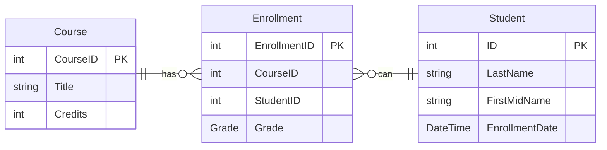

# ContosoUniversity

## Overview

This project is a sample library that extracts the infrastructure layer of a fictional Contoso University
and is referenced by other test projects for learning purposes.

The following site was used as reference:

- [ASP.NET Core Razor Pages with Entity Framework Core - Tutorial 1/8](https://docs.microsoft.com/ja-jp/aspnet/core/data/ef-rp/intro)

## The data model

The following sections create a data model:

